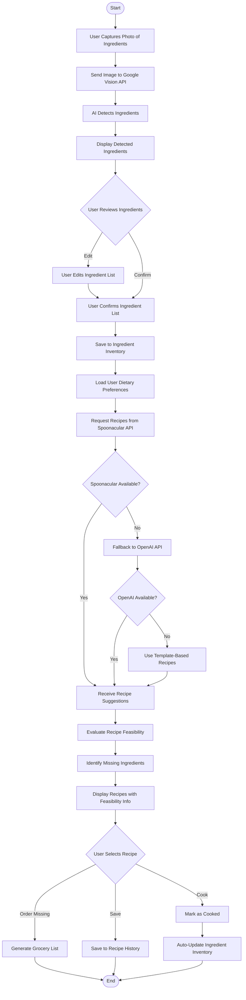
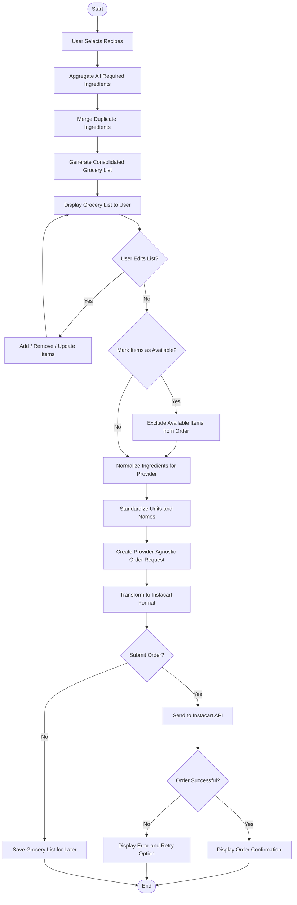
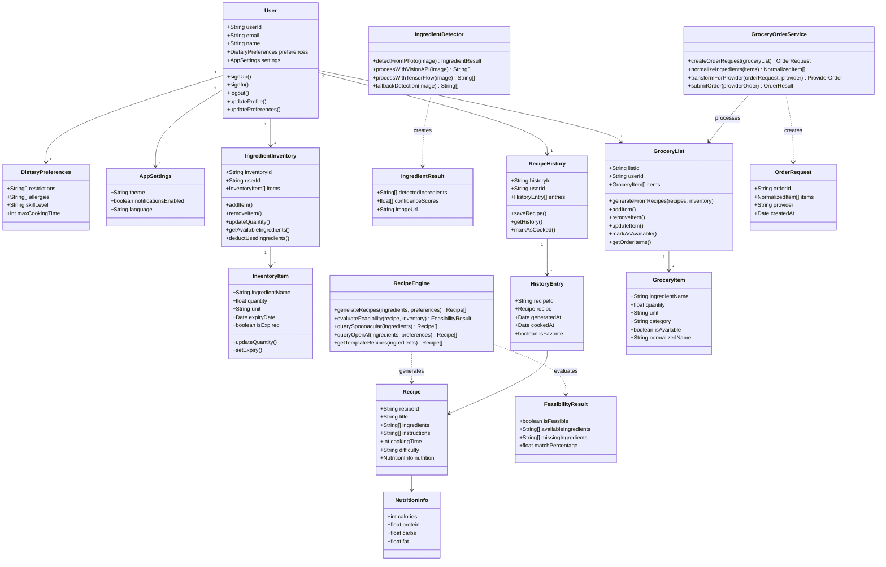
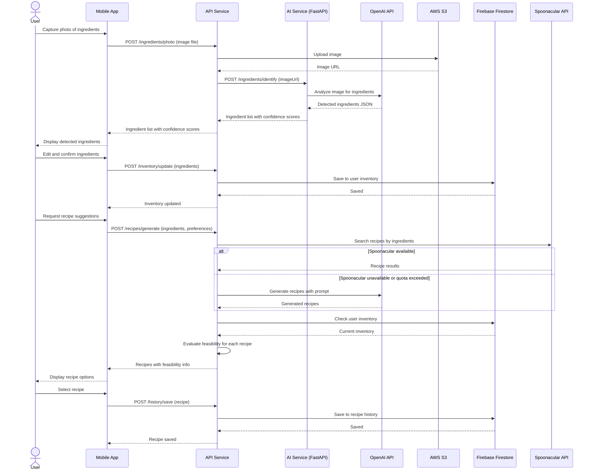
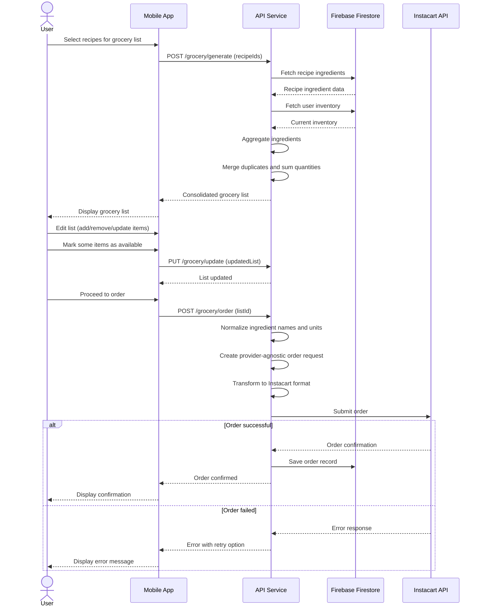

# Part B - UML Diagrams

This document contains all UML diagrams for the CSYE 7230 Project Part B report.
Diagrams are written in Mermaid syntax for collaborative editing.
Please remove/add features based on your work. We will export as images for the final PDF report. 

---

## 1. Use Case Diagram

Describes the use cases of the application and the actors and external systems involved.

```mermaid
graph TB
    subgraph Actors
        User((User))
        Admin((Admin))
    end

    subgraph External Systems
        GoogleVision[Google Vision API]
        Spoonacular[Spoonacular API]
        OpenAI[OpenAI API]
        Instacart[Instacart API]
        Firebase[Firebase]
        AWSS3[AWS S3]
    end

    subgraph ReplateAI Application
        UC1[Sign Up / Sign In / Logout]
        UC2[Manage Profile and Dietary Preferences]
        UC3[Configure App Preferences]
        UC4[Capture Ingredients via Photo]
        UC5[Manually Add Ingredients]
        UC6[Review and Edit Detected Ingredients]
        UC7[Track Ingredient Quantity and Expiry]
        UC8[Generate Personalized Recipes]
        UC9[View Recipe Feasibility and Missing Ingredients]
        UC10[Save and View Recipe History]
        UC11[Generate Grocery List from Recipes]
        UC12[Edit Grocery List]
        UC13[Mark Ingredients as Available]
        UC14[Create Grocery Order]
        UC15[Manage Ingredient Inventory]
    end

    User --> UC1
    User --> UC2
    User --> UC3
    User --> UC4
    User --> UC5
    User --> UC6
    User --> UC7
    User --> UC8
    User --> UC9
    User --> UC10
    User --> UC11
    User --> UC12
    User --> UC13
    User --> UC14
    User --> UC15

    UC1 --> Firebase
    UC4 --> GoogleVision
    UC8 --> Spoonacular
    UC8 --> OpenAI
    UC14 --> Instacart
    UC10 --> Firebase
    UC15 --> Firebase
    UC4 --> AWSS3
```

---

## 2. Activity Diagram - Recipe Generation Flow

Describes the control flow for the most important use case: generating recipes from captured ingredients.

---

## 3. Activity Diagram - Grocery Ordering Flow

Describes the control flow for converting recipes into grocery orders.

---

## 4. Class Diagram

Describes the classes, data structures, attributes, relations, and operations of the application.

---

## 5. Sequence Diagram - Photo to Recipe Flow

Describes the scenario of a user capturing ingredients and generating recipes.

---

## 6. Sequence Diagram - Grocery Ordering Flow

Describes the scenario of a user creating a grocery order from selected recipes.

---

## Notes for Team

- Edit this file directly and push changes to collaborate
- Use Mermaid Live Editor (https://mermaid.live) to preview diagrams
- Export diagrams as PNG/SVG for the final PDF report
- Each team member can contribute to their relevant sections
